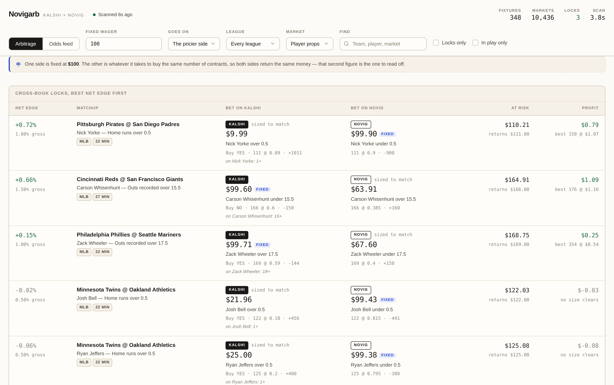

# Novigarb

A live arbitrage scanner for **Kalshi** and **Novig** — an OddsJam-style board, but built for
exactly two venues and for the one thing that matters: locking a guaranteed profit by buying
both sides of the same proposition on different books.

It runs entirely on your machine, needs no API keys, and installs nothing.



## Run it

**Double-click `Start Novigarb.command`.** A Terminal window opens, the scanner starts, and
your browser lands on the board once the first scan is in. Closing that window stops it.

The first time, macOS may say the file is from an unidentified developer — right-click it,
choose **Open**, then **Open** again. macOS remembers after that.

Prefer a terminal?

```bash
node server.js          # then open http://localhost:8787
npm run scan            # or just print one scan and exit
```

Requires Node 18 or newer (`node --version`); the launcher checks and tells you if it is
missing. There are no dependencies to install — the whole thing is standard library plus `fetch`.

## What it does

Every few seconds it:

1. Asks **Novig** which fixtures are open right now (that also tells it which leagues are in season).
2. Pulls the matching **Kalshi** series for those leagues — moneyline, spread and total.
3. Matches fixtures across the two books by team identity and date.
4. Compares every proposition both venues quote, in both directions.
5. Walks each venue's real order book to price a two-leg lock, net of both fee schedules.
6. Streams the ranked results to the browser over Server-Sent Events.

The **Arbitrage** tab ranks every cross-book pair by net edge. The **Odds feed** tab is the raw
two-column board — what Kalshi is asking, what Novig is asking, for every market they share.

## Sizing: one side fixed, the other sized to match

This is the part worth understanding, because it is how the board is meant to be read.

**One leg is fixed at $100.** The other is *not* $100 — it is whatever it takes to buy the
same number of contracts on the other venue. That is what makes it a lock: equal contracts on
both sides means the same payout whichever way the game goes, so the second figure is the one
you actually have to look up.

A real row:

```
Pittsburgh Pirates @ San Diego Padres        Spread — San Diego Padres -2.5

  KALSHI    $28.38    San Diego Padres -2.5   Buy YES · 129 @ 0.22
                                              on "San Diego wins by over 2.5 runs"
  NOVIG     $99.98    PIT +2.5      FIXED     129 @ 0.775
```

$99.98 on Novig is the fixed side. $28.38 on Kalshi is what 129 contracts cost there. Both
sides return $129.00, so the whole position risks $129.14 including fees.

Every leg names **the outcome it pays on**, not the market it happens to live in. Kalshi quotes
a NO on "New England wins" — this shows that leg as *Seattle Seahawks*, with `Buy NO on New England`
underneath, so you know both what you are backing and which button to press.

Change the amount in the header. **Goes on** picks which side is held fixed:

- **The pricier side** (default) — so no single leg goes over your number.
- **The Kalshi side** / **The Novig side** — pin a specific venue.

Size is capped by what the two books can actually fill. Click a row for the full slip: average
fill, slippage against the quoted top, fee, and the market identifier to paste into each venue.

## Reading the numbers

**Gross** is the edge before fees: `1 − (priceA + priceB)`. **Net edge** is what you keep.

The gap between them is usually the whole story, because Kalshi's trading fee is quadratic:

```
Kalshi fee  =  ceil( 0.07 × multiplier × contracts × P × (1−P) )    rounded up to the cent
Novig fee   =  0.03 × contracts × P × (1−P)                          live games only
```

At even money that Kalshi fee is **1.75¢ per contract** — so a 1% gross edge is a losing trade,
and you need roughly 1.8% gross before the lock clears. Two things move in your favour:

- **Novig charges nothing before kickoff.** Pre-game fills are free on that leg, so pre-game
  locks only have to cover the Kalshi side.
- **Some Kalshi series are cheaper.** MLB game/spread/total carry a 0.5× multiplier, halving the
  fee. Novigarb reads each series' real `fee_multiplier` from the API rather than assuming one rate.

That is why the board often shows plenty of 1% gross edges and no profitable arbitrage. It is not
a bug — it is the fee wall, and the **Gross** column is there so you can see exactly where the
edge went. Untick *Profitable only* (the default) to watch how close the books are running.

**Best size** is the position that makes the most money on current depth, found by evaluating the
profit at every order-book breakpoint. A thin best level with a bad second level will show a small
best size — that is the honest number.

## Markets covered

| | |
|---|---|
| **Player props** | MLB: hits, home runs, H+R+RBI, RBIs, total bases, stolen bases, strikeouts, outs recorded, hits allowed, earned runs, walks allowed. NFL: pass/rush/receiving yards, receptions, passing TDs. NBA & WNBA: points, rebounds, assists, threes (plus PRA on NBA). NHL: points, assists, saves |
| **Two-way moneyline** | MLB, NFL, NBA, NHL, WNBA, NCAAF, NCAAB, CFL, ATP, WTA |
| **Three-way (win / draw)** | Premier League, La Liga, Serie A, Ligue 1, Bundesliga, MLS, Champions League, Europa League |
| **Spreads, totals, team totals** | every league above that lists them on both venues |

**Baseball props are the richest hunting ground**, for two reasons. Both books quote integer
stats on the same `.5` lines, so they compare exactly — Kalshi phrases it as "1+ hits" but
reports the strike as 0.5, which is precisely Novig's line. And Kalshi's MLB series carry a
**0.5× fee multiplier**, halving the cost that usually eats the edge. Locks show up on props
that never appear on game lines.

Props only pair when the stat, the player and the strike all agree. Around half of Kalshi's
MLB prop markets have no Novig counterpart at the same number — Kalshi posts a ladder
(1+, 2+, 3+…) where Novig posts one or two lines per player — and that is a real limit, not a
matching failure.

Leagues are only scanned when Novig actually has open fixtures, and a series that comes back
empty rests for a while before being checked again, so an out-of-season sport costs nothing.

## Configuration

All optional, all environment variables:

| Variable | Default | Meaning |
|---|---|---|
| `PORT` | `8787` | Web server port |
| `POLL_MS` | `8000` | Pause between scans (a scan takes ~2–3s) |
| `TARGET_STAKE` | `100` | Starting stake for the anchor leg |
| `NEAR_MISS_EDGE` | `-0.02` | Screen-in threshold; pairs below this are not order-book priced |
| `KALSHI_FEE_COEFFICIENT` | `0.07` | Kalshi's quadratic coefficient |
| `NOVIG_FEE_COEFFICIENT` | `0.03` | Novig's live taker coefficient |
| `KALSHI_CONCURRENCY` | `6` | Kalshi series fetched in parallel |
| `KALSHI_DORMANT_CYCLES` | `20` | Cycles to rest a series that returned nothing |
| `BOARD_LIMIT` | `500` | Odds-feed rows sent to the browser |

```bash
PORT=9000 TARGET_STAKE=250 node server.js
```

Both fee coefficients are published schedules that can change — Novig explicitly says to read the
rate from their fees page rather than hardcoding it. Check
[Novig's fee page](https://docs.novig.com/fees) and Kalshi's fee schedule, and override here if
they move.

## How matching works

Getting the fixtures paired correctly is most of the problem. The books disagree constantly:

- Kalshi calls the Nationals `WSH`, Novig calls them `WAS`.
- Novig uses `CHI` for **both** Chicago baseball clubs; Kalshi splits them into `CHC` and `CWS`.
- Kalshi truncates names — `Chicago WS`, `New York M` — where Novig spells them out.
- Soccer fixtures list home and away in opposite order across the two venues.

So matching scores team names rather than trusting abbreviations: exact tokens, prefixes
(`M` → `Mets`), and acronyms (`WS` → `White Sox`), combined with abbreviation equality, gated on
an Eastern-time date window and resolved greedily one-to-one.

Sides are then anchored to **Novig's** home/away orientation, and every Kalshi market is mapped to
a team by identity — never by position. That is what keeps a home/away disagreement from silently
inverting a leg, which would turn a "lock" into two bets on the same outcome.

Each row shows its match confidence in the bet slip. Anything below 70% is discarded.

**Players are matched on the full name only.** A first-initial-plus-surname fallback would
look tempting — it rescues a handful of extra props — but the Cubs and Brewers field
`Willson Contreras` and `William Contreras`, brothers who both catch. Pairing them would
produce a confident-looking "lock" that is really two bets on two different people. Missing a
prop costs nothing; inventing one costs money, so the strict key stays.

## Data sources

Both are public, read-only, and unauthenticated:

- **Kalshi** — REST Trade API, `https://external-api.kalshi.com/trade-api/v2`
  ([market data quickstart](https://docs.kalshi.com/getting_started/quick_start_market_data))
- **Novig** — GraphQL, `https://gql.novig.us/v1/graphql`
  ([overview](https://docs.novig.com/api-reference/graphql/overview))

Two details worth knowing if you extend this:

- Kalshi order books contain **bids only**. A NO bid at `q` is a YES ask at `1 − q` for the same
  size, which is how the ask ladders in `src/kalshi.js` are derived.
- Novig orders are **all bids**, and `qty` is in cents of payout (100 `qty` = one $1 contract). A
  bid on one outcome is offered liquidity on its sibling — see `askLadderFromSiblingBids`.
- Novig's GraphQL endpoint enforces a 4-second statement timeout, so queries are sharded and
  order depth is fetched separately from prices.

## Layout

```
Start Novigarb.command   double-click launcher for macOS
server.js            HTTP server, SSE stream, settings endpoint
src/config.js        tunables, fee schedules, league -> Kalshi series map
src/kalshi.js        Kalshi adapter: fixtures, order books, fee model
src/novig.js         Novig adapter: events, markets, bid ladders, fee model
src/teams.js         team-name normalisation and similarity scoring
src/match.js         fixture matching and canonical contract construction
src/arb.js           book walking, lock pricing, optimal sizing
src/engine.js        scan orchestration
public/              dashboard (no build step, no framework)
scripts/scan-once.js one-shot terminal scan
```

## Caveats

This finds and prices opportunities. It does not place bets, and there is no trading code in it.

Quotes move between the scan and your click, a leg can fill partially, and a lock with one leg
filled is just a directional bet. Order books are also snapshots — size shown at a price can be
gone before you get there. Treat every row as a lead to verify on the venue, not a filled ticket.

Novig's GraphQL API is documented as deprecated in favour of their authenticated REST API. It is
live and unauthenticated today, which is what makes this run without keys; if it is retired,
`src/novig.js` is the only file that needs to change.
